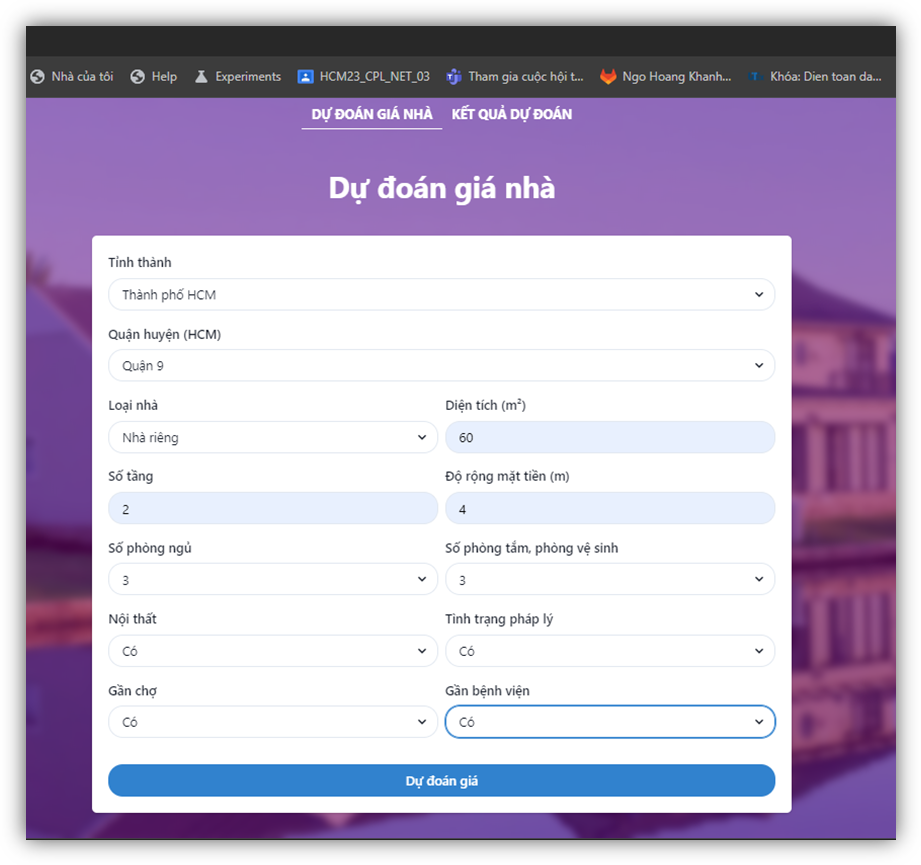
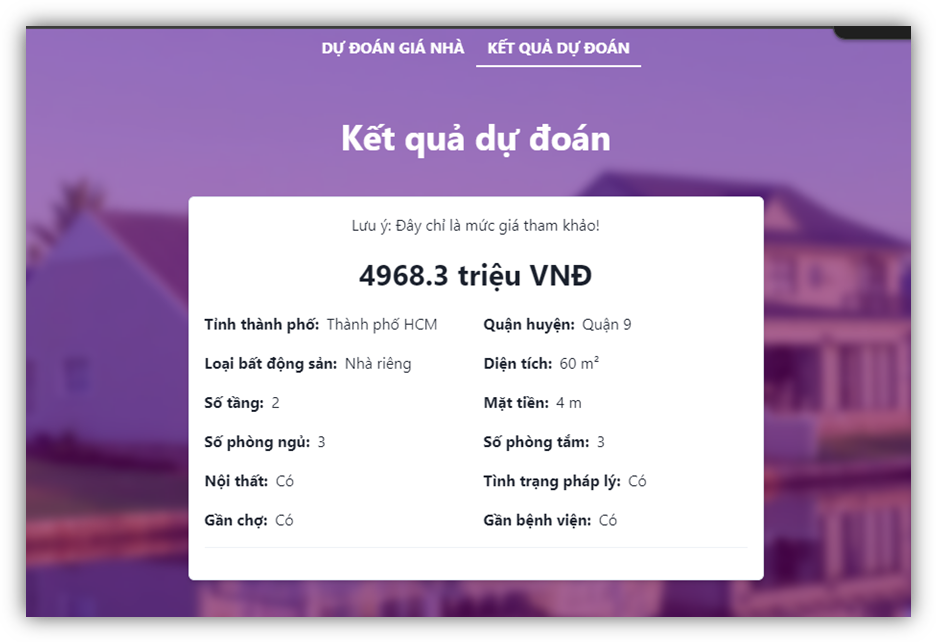
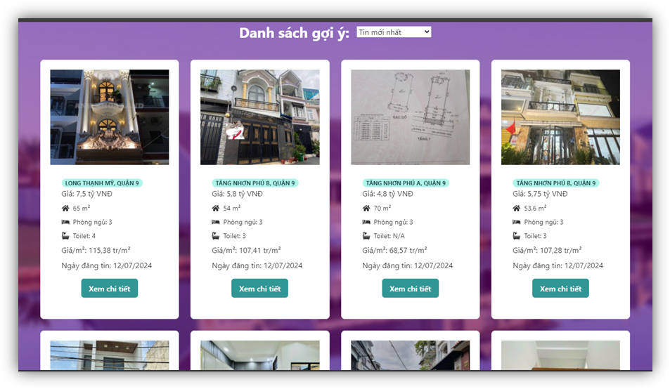

# Real Estate Price Prediction Project

## Overview

This project focuses on predicting real estate prices using machine learning techniques. The project is divided into two main components:

- **Data Collection**: Scraping real estate data from the website [batdongsan.com.vn](https://batdongsan.com.vn) and preparing it for model training.
- **Web Application**: A web-based platform that allows users to input real estate details and receive price predictions based on the trained model.

## Directory Structure

- **`Code_Data`**: Contains code and scripts for web scraping real estate data from batdongsan.com.vn. This includes cleaning and processing data for use in machine learning models.
  
- **`Code_Web_App`**: Contains code for the web application, which predicts real estate prices based on user input. The web app is designed to be user-friendly and provides predictions in real-time.
  
- **`Images_Demo`**: Contains demo images showcasing the functionality and user interface of the web app.

## Demo Images

Below are some demo images of the web application interface and features:

- **Home Page**  
  

- **Prediction Result**  
  

- **Recommend List Page**  
  

## Features

- Web scraping of real estate data from batdongsan.com.vn
- Data cleaning and preprocessing for machine learning
- Real-time real estate price prediction based on user input
- Intuitive web interface for ease of use